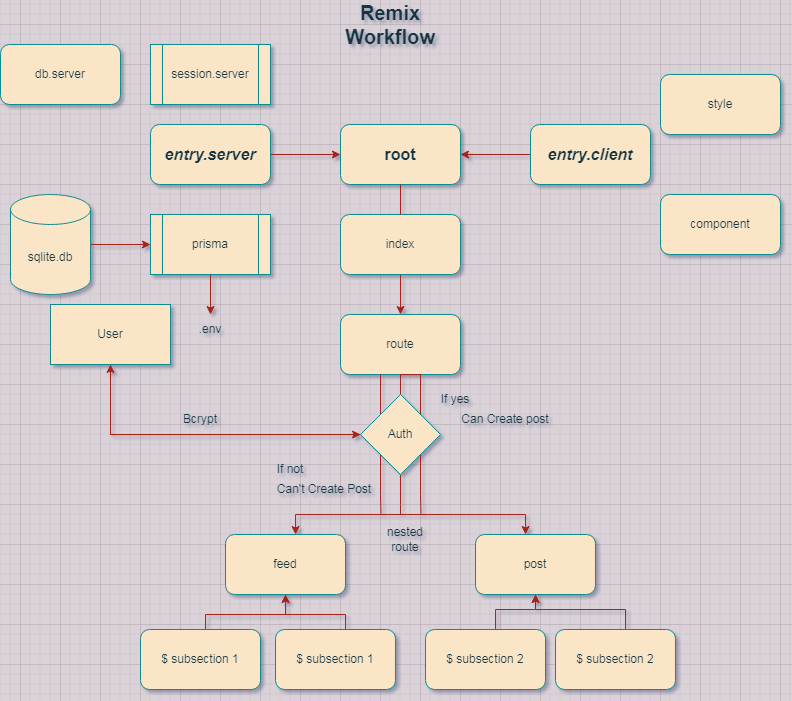

# Experiment 4

## Remix Forum

Bootstraped by Remix Jokes Template with some another function


### Title : Remix Forum Stack

### Tipe : Experiment (from template Remix Jokes)

### Goals : Deliver A Complete Forum Application with Database and Auth for User

### Libraries used:
- Remix
- React JS
- Prisma
- SQLite
- Bcrypt


## Flowchart




## Local Development

From your terminal:

```sh
npm install
npm run dev
```

This starts your app in development mode, rebuilding assets on file changes.

## Deployment

First, build your app for production:

```sh
npm run build
```

Then run the app in production mode:

```sh
npm start
```

## Next To Do 

- Deployment to Vercel
